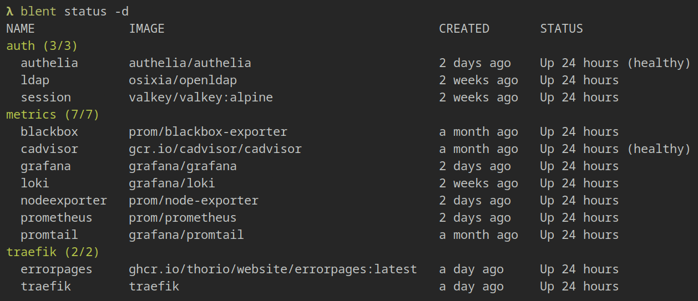
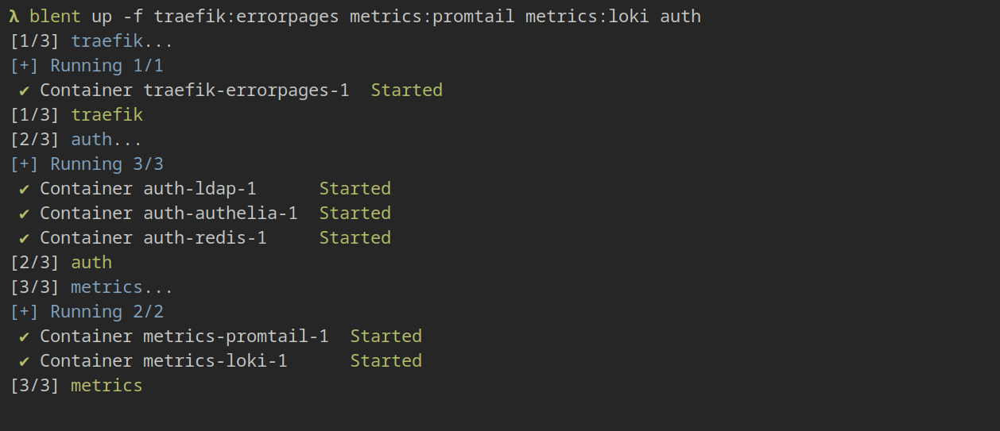
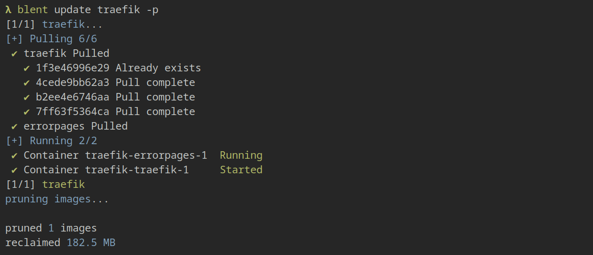

# blent


blent is a devops tool for ergonomically managing many docker-compose projects.  
It provides a simple CLI to query and manage individual services or multiple projects, simplifying deployment and updates.

<div>
  
  
  
</div>

*click to enlarge*

## Features
- Overview of services
- Fine-grained target filtering
- One command for updating all of your containers
- Starting, stopping and viewing logs of services

# Usage
## Directory Layout
blent expects stacks as compose files in separate directories below the app path, like this:

```
app/
  stack-1/
    compose.yml
  stack-2/
    compose.yml
```
You can name your compose files `compose` or `docker-compose`, `.yml` or `.yaml`, but they _must_ be in a structure like the above.  
Symlinks _should_ work, but this is mostly contingent on docker-compose and not tested.

> [!TIP]
> You can prefix directories with a `.` to make blent ignore them.

## Filters
Most commands accept a *filter* argument, allowing you to specify which stacks/services to act upon. This comes in the form of either `stack:service` or just `stack`, referring to the individual service or all services of the stack, respectively.

## Subcommands
### Status
`blent status [-d] [FILTER]...`

Shows an overview of all stacks, allowing you to quickly grasp the state of your system.  
`-d`: shows additional details in a tabular format, listing each service along with key information.

If no filter is supplied, all stacks are shown.

<details>
<summary><em>click to show example</em></summary>

```
$ blent status -d auth traefik metrics
NAME             IMAGE                                      CREATED          STATUS
auth (3/3)
  authelia       authelia/authelia                          18 minutes ago   Up 18 minutes (healthy)
  ldap           osixia/openldap                            18 minutes ago   Up 18 minutes
  session        valkey/valkey:alpine                       18 minutes ago   Up 18 minutes
metrics (7/7)
  blackbox       prom/blackbox-exporter                     a month ago      Up 26 hours
  cadvisor       gcr.io/cadvisor/cadvisor:v0.49.1           a month ago      Up 26 hours (healthy)
  grafana        grafana/grafana                            2 days ago       Up 26 hours
  loki           grafana/loki                               18 minutes ago   Up 18 minutes
  nodeexporter   prom/node-exporter                         2 days ago       Up 26 hours
  prometheus     prom/prometheus                            2 days ago       Up 26 hours
  promtail       grafana/promtail                           18 minutes ago   Up 18 minutes
traefik (2/2)
  errorpages     ghcr.io/thorio/website/errorpages:latest   18 minutes ago   Up 18 minutes
  traefik        traefik                                    an hour ago      Up 55 minutes
```
</details>

### Up
`blent up [-f] (<FILTER>... | -a) [-- <COMPOSE_ARGS>...]`

Creates/starts/updates specified services, just like `docker compose up`.  
`-f`: Recreates containers, even when they are already up-to-date. Equivalent to compose's `--force-recreate`.  
`-a`: When passed instead of a filter, operates on all known services.

Arguments after `--` will be passed to docker compose as-is.

<details>
<summary><em>click to show example</em></summary>

```
$ blent up -f traefik:errorpages metrics:promtail metrics:loki auth
[1/3] auth...
[+] Running 3/3
 ✔ Container auth-session-1   Started
 ✔ Container auth-authelia-1  Started
 ✔ Container auth-ldap-1      Started
[1/3] auth
[2/3] traefik...
[+] Running 1/1
 ✔ Container traefik-errorpages-1  Started
[2/3] traefik
[3/3] metrics...
[+] Running 2/2
 ✔ Container metrics-promtail-1  Started
 ✔ Container metrics-loki-1      Started
[3/3] metrics
```
</details>

### Down
`blent down [-r] (<FILTER>... | -a) [-- <COMPOSE_ARGS>...]`

Stops and removes specified services, just like `docker compose down`.  
`-r`: Equivalent to compose's `--remove-orphans`.  
`-a`: When passed instead of a filter, operates on all known services.

Arguments after `--` will be passed to docker compose as-is.

<details>
<summary><em>click to show example</em></summary>

```
$ blent down auth
[1/1] auth...
[+] Running 5/5
 ✔ Container auth-authelia-1  Removed
 ✔ Container auth-session-1   Removed
 ✔ Container auth-ldap-1      Removed
 ✔ Network ldap               Removed
 ✔ Network auth_default       Removed
[1/1] auth
```
</details>

### Logs
`blent logs [-f] <FILTER>... [-- <COMPOSE_ARGS>...]`

Shows the logs of the specified services, just like `docker compose logs`.  
`-f`: Follows the output. Equivalent to compose's `--follow`.

Arguments after `--` will be passed to docker compose as-is.

> [!NOTE]
> This command cannot be used on multiple stacks at once.

<details>
<summary><em>click to show example</em></summary>

```
$ blent logs auth:authelia
authelia-1  | time="2025-02-02T12:54:34+01:00" level=info msg="Authelia v4.38.18 is starting"
authelia-1  | time="2025-02-02T12:54:34+01:00" level=info msg="Log severity set to info"
authelia-1  | time="2025-02-02T12:54:34+01:00" level=info msg="Storage schema is being checked for updates"
authelia-1  | time="2025-02-02T12:54:34+01:00" level=info msg="Storage schema is already up to date"
authelia-1  | time="2025-02-02T12:54:34+01:00" level=info msg="Startup complete"
authelia-1  | time="2025-02-02T12:54:34+01:00" level=info msg="Listening for non-TLS connections on '[::]:8080' path '/'" server=main service=server
```
</details>

### Update
`blent update [-p] (<FILTER>... | -a) [-- <COMPOSE_ARGS>...]`

Pulls the latest images for the specified services and recreates the containers.  
`-p`: Prunes images that are left dangling after the update.  
`-a`: When passed instead of a filter, operates on all known services.

Arguments after `--` will be passed to docker compose (`pull` and `up` commands) as-is.

> [!IMPORTANT]
> blent will only pull the tag you specified in your compose file, it will _not_ update your compose file.  
> Use tags like `:latest`, `:v3` or similar to allow for updates without compose file modification.

<details>
<summary><em>click to show example</em></summary>

```
$ blent update traefik -p
[1/1] traefik...
[+] Pulling 6/6
 ✔ errorpages Pulled
 ✔ traefik Pulled
   ✔ 1f3e46996e29 Already exists
   ✔ 4cede9bb62a3 Pull complete
   ✔ b2ee4e6746aa Pull complete
   ✔ 7ff63f5364ca Pull complete
[+] Running 2/2
 ✔ Container traefik-errorpages-1  Running
 ✔ Container traefik-traefik-1     Started
[1/1] traefik
pruning images...

pruned 1 images
reclaimed 182.5 MB
```
</details>

# Installation
Binaries are available for the following platforms:
| Platform | |
| --- | --- |
| Arch | [Package][arch-pkg] |
| Debian | [Package][debian-deb] |
| Linux | [Binaries][linux-tar] |

[arch-pkg]: https://github.com/thorio/blent/releases/latest/download/blent-arch-x86_64.pkg.tar.zst
[debian-deb]: https://github.com/thorio/blent/releases/latest/download/blent-debian-x86_64.deb
[linux-tar]: https://github.com/thorio/blent/releases/latest/download/blent-linux-x86_64.tar.gz

### Configuration
The only configurable option is the directory in which compose stacks are placed (`--app-path`).  
If you do not want to use the default path `~/app`, it is recommended to add an alias to your shell configuration.

# Development
Using the devcontainer is highly encouraged to get up and running ASAP, otherwise:

- [Install Rust][rustup]
- Use [normal cargo commands][cargo] for development (`cargo build`, `cargo run`), use [`cargo-make`][cargo-make] for packaging.

[rustup]: https://www.rust-lang.org/tools/install
[cargo]: https://doc.rust-lang.org/cargo/
[cargo-make]: https://github.com/sagiegurari/cargo-make
